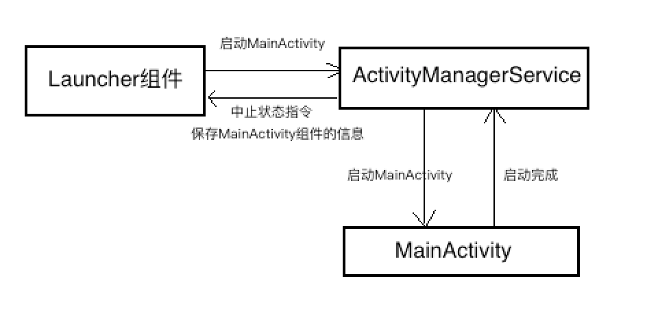

#Android系统源代码情景分析笔记
Activity组件的启动过程分析

[toc]

##根Activity启动的过程分析
###Launcher组件启动MainActivity的流程分析
1. Launcher组件项ActivityManagerService发送一个启动MainActivity组件的进程间通信请求
2. ActivityManagerService首先将要启动的MainActivity组件的信息保存下来,然后再向Launcher组件发送一个进入中止状态的进程间通信请求
3.Launcher组件进入到中止状态之后,就会向ActivityManagerService发送一个已进入中止状态的进程间通信请求,以便ActivityManagerService可以继续执行启动MainActivity组件的操作
4.ActivityManagerService可以继续执行启动MainActivity组件的操作，但是要先讲MainActiivty的宿主进程给创建出来,创建完成以后才能去进行启动MainActivity组件的操作
5.ActivityManagerService将启动在第2步保存下来的MainActivity组件的信息发送给第4步创建的应用程序进程,以便它可以将MainActivity组件启动起来
总结整个流程图大概如下：

启动流程非常复杂,大概有35个步骤

###setp1：Launcher.startActivitySafely
/packages/apps/Launcher3/src/com/android/launcher3/Launcher.java
```
public class Launcher extends Activity
	implements View.OnClickListener,OnLongClickListener,
	LauncherModel.Callbacks,View.OnTouchListener,
	PageSwitchListener,LauncherProviderChangeListener,
	LauncherStateTransitionAnimation.Callback{
		...
		boolean startActivitySafely(View v, Intent intent, 
			Object tag) {
	        boolean success = false;
	        ...
	        try {
	         //调用startActivity方法去启动应用的根Activity
	           success = startActivity(v, intent, tag);
	        } catch (ActivityNotFoundException e) {
	           ...
	        }
	        return success;
	    }
	    ...
}    
```
首次启动应用时候,会执行**Launcher**组件的**startActivitySafely**方法，要启动应用的根Activity信息包含在参数intent重,可以看到这个方法主要调用了**Launcher**组件的**startActivity**方法,
/packages/apps/Launcher3/src/com/android/launcher3/Launcher.java

```
	 private boolean startActivity(View v, Intent intent, 
		 Object tag) {
		 //添加启动新的应用标识
        intent.addFlags(Intent.FLAG_ACTIVITY_NEW_TASK);
        try{
	        ...
	        //
	        startActivity(intent, optsBundle);
	        ...
	        return true;
        }cache(SecurityException e){
		    ...
        }
        return false;
```
由于Launcher是Activity的子类,可以看到**Launcher**组件的**startActivity**最终调用了**Activity**的**startActivity**方法
###step2：Activity.startActivity
/frameworks/base/core/java/android/app/Activity.java

```
	public class Activity extends ContextThemeWrapper
        implements LayoutInflater.Factory2,
        Window.Callback, KeyEvent.Callback,
        OnCreateContextMenuListener, ComponentCallbacks2,
        Window.OnWindowDismissedCallback {
        ...
	    @Override
	    public void startActivity(Intent intent, 
		    @Nullable Bundle options) {
	        if (options != null) {
	            startActivityForResult(intent, -1, options);
	        } else {
		        //最终也会调用到上面那个分支的函数
	            startActivityForResult(intent, -1);
	        }
	    }
        ...
    }
```
这里调用了Activity组件的**startActivityForResult**,跟进如下
###step3：Activity.startActivityForResult

```
public void startActivityForResult(Intent intent, int requestCode, Bundle options) {
	if (mParent == null) {
        Instrumentation.ActivityResult ar =
            mInstrumentation.execStartActivity(this,
	            mMainThread.getApplicationThread(), mToken, this,
                intent, requestCode, options);
        ...
    }else{
	    ...
    }
}
```
####mInstrumentation
这里看到调用了**mInstrumentation.execStartActivity**方法,Activity的成员变量mInstrumentation类型是**Instrumentation**,它是用来**监控应用程序和系统之间交互操作**。由于启动Activity组件是应用程序与系统之间的一个交互操作,所以**mInstrumentation.execStartActivity**这个方法其实就是用来代理Activity启动的操作,并且能够监视整个交互的过程。
####mMainThread.getApplicationThread()参数
Activity的成员变量**mMainThread**的类型为**ActivityThread**，用来描述**一个应用程序进程**。每当系统启动一个应用程序进程时，都会在它里面加载一个ActivityThread类实例，并且会将这个ActivityThread类实例保存在每一个在该进程中启动的Activity组件的父类Activity的成员变量**mMainThread**中。ActivityThread类的成员函数getApplicationThread用来获取它内部的一个类型为ApplicationThread的Binder本地对象。mInstrumentation.execStartActivity方法中将ApplicationThread对象作为参数传递,这样就可以把这个Binder对象传递给ActivityManagerService,因此ActivityManagerServcie接下来就可以通知Launcher组件进入Paused状态了。
####mToken参数
Activity类的成员变量mToken的类型是IBinder，它是一个Binder代理对象，**指向了ActivityManagerService中一个类型为ActivityRecord的Binder本地对象**。每一个已经启动的Activity组件在ActivityManagerService中都有一个对应的的ActivityRecord对象，用来维护对应的Activity组件的运行状态。mInstrumentation.execStartActivity方法中将将mToken作为参数传递,这样接下来ActivityManagerService就能够获取到Launcher组件的详细信息了。
###setp4：Instrumentation.execStartActivity
/frameworks/base/core/java/android/app/Instrumentation.java
```
public class Instrumentation {
	...
	public ActivityResult execStartActivity(Context who, 
		IBinder contextThread, IBinder token, Activity target,
		Intent intent, int requestCode, 
		Bundle options){
	        IApplicationThread whoThread = 
		        (IApplicationThread) contextThread;
	        ...
	        try {
		        ...
		        int result = ActivityManagerNative.getDefault()
		            .startActivity(whoThread, 
			            who.getBasePackageName(),
			            intent,
			            intent.resolveTypeIfNeeded(
			            who.getContentResolver()),
	                    token, 
	                    target != null ? 
	                    target.mEmbeddedID : null,
	                    requestCode, 0, null, options);
		       ...
	        } catch (RemoteException e) {
	           ...
	        }
	        ...
    }
	...
}
```
可以看到Instrumentation.execStartActivity主要是调用**ActivityManagerNative**类的静态成员函数**getDefault**获取一个ActivityManagerService的代理对象，然后调用**ActivityManagerNative**的成员函数**startActivity**去启动一个Activity组件
####ActivityManagerNative.getDefault
/frameworks/base/core/java/android/app/ActivityManagerNative.java

```
public abstract class ActivityManagerNative extends Binder 
	implements IActivityManager{
		...
		static public IActivityManager asInterface(IBinder obj) {
	        if (obj == null) {
	            return null;
	        }
	        IActivityManager in =
	            (IActivityManager)obj.
		            queryLocalInterface(descriptor);
	        if (in != null) {
	            return in;
	        }
	
	        return new ActivityManagerProxy(obj);
	    }
	    
		private static final Singleton<IActivityManager> gDefault = 
			new Singleton<IActivityManager>() {
		        protected IActivityManager create() {
		            IBinder b = ServiceManager.
			            getService("activity");
		            ...
		            IActivityManager am = asInterface(b);
		            ...
		            return am;
		        }
	    };
		   
		static public IActivityManager getDefault() {
	        return gDefault.get();
	    }
		...
}
```
- 可以看到首次调用getDefalut时,实际上是通过ServiceManager去获取一个名称为“activity“的Java服务代理对象，也就是获得了一个引用了ActivityManagerService的代理对象。那么接着调用**asInterface**将这代理对象封装成一个**ActivityManagerNativeProxy**的代理对象,最后将其保存在成员变量gDefault中。这样，以后再次调用ActivityManagerNative的成员函数getDefalut时，就可以直接获得ActivityManagerService的一个代理对象。
### step5：ActivityManagerProxy.startActivity
- 回到**Instrumentation.execStartActivity**，现在我们知道了ActivityManagerNative.getDefault()实际上获取的是一个**ActivityManagerNativeProxy**代理对象,那么实际上调用的也就它的startActivity方法
/frameworks/base/core/java/android/app/ActivityManagerNative.java

```
public abstract class ActivityManagerNative extends Binder 
	implements IActivityManager{
	...
	class ActivityManagerProxy implements IActivityManager{
		    public int startActivity(IApplicationThread caller, 
			    String callingPackage,Intent intent,String resolvedType, 
			    IBinder resultTo, String resultWho, int requestCode,
			    int startFlags, ProfilerInfo profilerInfo, 
			    Bundle options) throws RemoteException {
			        Parcel data = Parcel.obtain();
			        Parcel reply = Parcel.obtain();
			        data.writeInterfaceToken(IActivityManager.descriptor);
			        //对应Activity中的mMainThread.getApplicationThread()
			        data.writeStrongBinder(caller != null ? 
				        caller.asBinder() : null);
			        //包名
			        data.writeString(callingPackage);
			        intent.writeToParcel(data, 0);
			        data.writeString(resolvedType);
			        //对应ActivityManagerService中的ActivityRecord
			        data.writeStrongBinder(resultTo);
			        data.writeString(resultWho);
			        data.writeInt(requestCode);
			        data.writeInt(startFlags);
			        if (profilerInfo != null) {
			            data.writeInt(1);
			            profilerInfo.writeToParcel(
				            data, Parcelable.PARCELABLE_WRITE_RETURN_VALUE);
			        } else {
			            data.writeInt(0);
			        }
			        if (options != null) {
			            data.writeInt(1);
			            options.writeToParcel(data, 0);
			        } else {
			            data.writeInt(0);
			        }
			        mRemote.transact(START_ACTIVITY_TRANSACTION, data, reply, 0);
			        reply.readException();
			        int result = reply.readInt();
			        reply.recycle();
			        data.recycle();
			        return result;
	    }
	}
	...
}
```
可以看到这个方法中,将前面传递过来的参数写入到Parcel对象data中,然后再通过**ActivityManagerNativeProxy**类内部的一个Binder代理对象**mRemote**向ActivityManagerService发送一个类型为**START_ACTIVITY_TRANSACTION**的进程间通信请求。
		这里面参数虽然非常多,但是需要注意的点参数只有三个，分别是**caller**、**intent**和**resultTo**。**caller**指向的是Launcher组件所运行在的应用程序进程的Appication对象；**intent**包含了即将启动的Activity组件信息；**resultTo**指向了ActivityManagerService内部的一个ActivityRecord对象，保存了Launcher组件的详细信息。
####ActivityManagerService处理进程通信指令
以上的5个步骤都是在Launcher进程中执行,接下来的6-12部是在ActivityManagerService中进行的，主要用来处理Launcher组件发出的**START_ACTIVITY_TRANSACTION**的进程间通信请求。如下图所示：

###step6：ActivityManagerService.startActivity
/frameworks/base/services/core/java/com/android/server/am/ActivityManagerService.java
```
public final class ActivityManagerService extends ActivityManagerNative
        implements Watchdog.Monitor, BatteryStatsImpl.BatteryCallback {
		...
		@Override
	    public final int startActivity(IApplicationThread caller, 
		    String callingPackage,Intent intent, String resolvedType, 
		    IBinder resultTo, String resultWho, int requestCode,int startFlags, 
		    ProfilerInfo profilerInfo, Bundle options) {
			    //caller是Launcher应用中对应的ApplicationThread代理对象
			    //callingPackage包名
			    //intent携带要启动的Activity组件信息
			    //resultTo指向ActivityRecord
		        return startActivityAsUser(caller, callingPackage, intent, 
			        resolvedType, resultTo,resultWho, requestCode, startFlags, 
			        profilerInfo, options,UserHandle.getCallingUserId());
	    }

	    @Override
	    public final int startActivityAsUser(IApplicationThread caller, 
		    String callingPackage,Intent intent, String resolvedType, 
		    IBinder resultTo, String resultWho, int requestCode,
		    int startFlags, ProfilerInfo profilerInfo, Bundle options, int userId){
			...
	        userId = handleIncomingUser(Binder.getCallingPid(), 
		        Binder.getCallingUid(),userId,false, ALLOW_FULL_ONLY, 
		        "startActivity", null);
	        // TODO: Switch to user app stacks here.
	        return mStackSupervisor.startActivityMayWait(caller, -1, 
		        callingPackage,intent,resolvedType, null, null, resultTo, 
		        resultWho, requestCode, startFlags,profilerInfo, null, null, 
		        options, false, userId, null, null);
		}
    ...
}
```
ActivityManagerService类的成员函数startActivity用来处理类型为**START_ACTIVITY_TRANSACTION**的进程间通信请求。
		ActivityManagerService类有一个类型为**ActivityStackSupervisor**的成员变量**mStackSupervisor**，用来管理Activity组件的堆栈，上面*ActivityManagerService.startActivityAsUser*中最终调用的是ActivityStackSupervisor的startActivityMayWait,来进一步处理类型为**START_ACTIVITY_TRANSACTION**的进程间通信请求,即执行一个启动Activity组件的操作。
###setp7：ActivityStackSupervisor.startActivityMayWait
/frameworks/base/services/core/java/com/android/server/am/ActivityStackSupervisor.java
```
public final class ActivityStackSupervisor implements DisplayListener {
	final int startActivityMayWait(IApplicationThread caller, int callingUid,
        String callingPackage, Intent intent, String resolvedType,
        IVoiceInteractionSession voiceSession, 
        IVoiceInteractor voiceInteractor,
        IBinder resultTo, String resultWho, int requestCode, int startFlags,
        ProfilerInfo profilerInfo, WaitResult outResult, Configuration config,
        Bundle options, boolean ignoreTargetSecurity, int userId,
        IActivityContainer iContainer, TaskRecord inTask) {
	       //解析Intent内容,获取更多即将启动的Activity的信息
	       ...
	       boolean componentSpecified = intent.getComponent() != null;

	       // Don't modify the client's object!
	       intent = new Intent(intent);
			
	        // Collect information about the target of the Intent.
	        ActivityInfo aInfo =
	                resolveActivity(intent, resolvedType, startFlags, 
	                profilerInfo, userId);
			...
	        synchronized (mService) {
		        ...
                try {
                      ResolveInfo rInfo =
                          AppGlobals.getPackageManager().resolveIntent(
                                  intent, null,
                                  PackageManager.MATCH_DEFAULT_ONLY
                                  | ActivityManagerService.STOCK_PM_FLAGS, userId);
                      //将解析到的信息保存到类型为ActivityInfo的aInfo对象中
                      aInfo = rInfo != null ? rInfo.activityInfo : null;
                      aInfo = mService.getActivityInfoForUser(aInfo, userId);
                } catch (RemoteException e) {
                    ...
                }
                ...
            }
			
			//继续执行启动Activity组件的工作
            int res = startActivityLocked(caller, intent, resolvedType, aInfo,
                    voiceSession, voiceInteractor, resultTo, resultWho,
                    requestCode, callingPid, callingUid, callingPackage,
                    realCallingPid, realCallingUid, startFlags, 
                    options, ignoreTargetSecurity,
                    componentSpecified, null, container, inTask);
            ...
            return res;
        }
    }
	
	//解析Intent内容,并保存到aInfo中
	ActivityInfo resolveActivity(Intent intent, String resolvedType, int startFlags,
            ProfilerInfo profilerInfo, int userId) {
        ActivityInfo aInfo;
        try {
            ResolveInfo rInfo =
                AppGlobals.getPackageManager().resolveIntent(
                        intent, resolvedType,
                        PackageManager.MATCH_DEFAULT_ONLY
                                    | ActivityManagerService.STOCK_PM_FLAGS, userId);
            aInfo = rInfo != null ? rInfo.activityInfo : null;
        } catch (RemoteException e) {
            ...
        }
        ...
        return aInfo;
    }
}    
```
上面这层的调用分为两个部分：
- 调用**resolveActivity**通过PackageManagerService服务区解析Intent参数的内容,获取即将启动的Activity组件更多的信息,接着将其存储到类型为ActivityInfo的对象aInfo中
- 调用**startActivityLocked**函数继续执行启动Activity组件的操作
###step8：ActivityStackSupervisor.startActivityLocked

```
final int startActivityLocked(IApplicationThread caller,
	Intent intent, String resolvedType, ActivityInfo aInfo,
	IVoiceInteractionSession voiceSession, 
	IVoiceInteractor voiceInteractor,
	IBinder resultTo, String resultWho, int requestCode,
	int callingPid, int callingUid, String callingPackage,
	int realCallingPid, int realCallingUid, int startFlags, Bundle options,
	boolean ignoreTargetSecurity, boolean componentSpecified, 
	ActivityRecord[] outActivity,
	ActivityContainer container, TaskRecord inTask) {
		int err = ActivityManager.START_SUCCESS;
		//获取描述Launcher组件的ProcessRecord
		ProcessRecord callerApp = null;
		if (caller != null) {
            callerApp = mService.getRecordForAppLocked(caller);
            if (callerApp != null) {
                callingPid = callerApp.pid;
                callingUid = callerApp.info.uid;
            } else {
                ...
            }
        }
		...
		//查找Launcher组件对应的ActivityRecord
		ActivityRecord sourceRecord = null;
		...
		if (resultTo != null) {
            sourceRecord = isInAnyStackLocked(resultTo);
            ...
        }
        ...
        //创建描述即将启动的Activity组件的ActivityRecord
        ActivityRecord r = new ActivityRecord(mService, callerApp, 
	        callingUid, callingPackage, intent, resolvedType, aInfo, 
	        mService.mConfiguration, resultRecord, resultWho, requestCode, 
	        componentSpecified, voiceSession != null, this, container, options);
		...
		err = startActivityUncheckedLocked(r, sourceRecord, voiceSession, 
			voiceInteractor,startFlags, true, options, inTask);
        return err;
}
```
####6.0下ActivityManagerService针对Activity堆栈存储分类
```
/** Mapping from displayId to display current state */
private final SparseArray<ActivityDisplay> mActivityDisplays = new SparseArray<>();

 
// Exactly one of these classes per Display in the system. 
// Capable of holding zero or more
// attached {@link ActivityStack}s 
class ActivityDisplay {
	/** Actual Display this object tracks. */
	//对应的ID
	int mDisplayId;
	/** All of the stacks on this display. Order matters, topmost stack is in front of all other stacks, bottommost behind. Accessed directly by ActivityManager package classes */
	//Activity栈
    final ArrayList<ActivityStack> mStacks = new ArrayList<ActivityStack>();
}

ActivityRecord isInAnyStackLocked(IBinder token) {
        int numDisplays = mActivityDisplays.size();
        for (int displayNdx = 0; displayNdx < numDisplays; ++displayNdx) {
            ArrayList<ActivityStack> stacks = mActivityDisplays.
	            valueAt(displayNdx).mStacks;
            for (int stackNdx = stacks.size() - 1; stackNdx >= 0; --stackNdx) {
                final ActivityRecord r = stacks.get(stackNdx).
		                isInStackLocked(token);
                if (r != null) {
                    return r;
                }
            }
        }
        return null;
}       
```
- 在ActivityManagerService中，每一个应用程序进程都使用一个**ProcessRecord**对象来描述,并且保存在ActivityManaagerService内部。ActivityStackSupervisor类成员变量mService指向了ActivityManagerService，`mService.getRecordForAppLocked(caller)`根据caller获取对应的一个ProcessRecord对象callerApp。由于caller对象指向的是Launcher组件所运行在的应用程序进程的一个ApplicationThread对象，所以，这里获取到的ProcessRecord对象callerApp实际上就指向了Launcher组件所在的应用程序。接着`callingPid = callerApp.pid`、 `callingUid = callerApp.info.uid`分别获取到Launcher进程的**PID**及**UID**，并保存在callingPid和callingUid中。
- 调用ActivityStackSupervisor的成员函数`isInAnyStackLocked(resultTo)`获Launcher组件对应的Activity组件堆栈。在这个堆栈中，每一个已经启动过的Activity组件都使用一个**ActivityRecord**对象来描述。前面提到，**参数resultTo指向的是Launcher组件在ActivityManagerService中的一个ActivityRecord对象**，因此，`isInAnyStackLocked(resultTo)`这个函数实际上就是从Activity组件堆栈存储管理**mActivityDisplays**中找到用来描述Launcher组件的一个ActivityRecord对象，并保存在局部变量sourceRecord中。
- 随后创建了ActivityRecord对象r来描述即将启动的Activity组件，即MainActivity
- 现在ActivityStackSupervisor类中就得到了请求ActivityManagerService执行启动Activity组件操作的源Activity组件(**Launcher组件**)，以及要启动的目标Activity组件信息(**MainActivity组件**)，分别保存在ActivityRecord对象sourceRecord和r中。最后调用成员函数`startActivityUncheckedLocked`来进一步执行启动目标Activity组件
###setp9：ActivityStackSupervisor.startActivityUncheckedLocked
```
final int startActivityUncheckedLocked(final ActivityRecord r, 
	ActivityRecord sourceRecord,IVoiceInteractionSession voiceSession, 
	IVoiceInteractor voiceInteractor, int startFlags,boolean doResume, 
	Bundle options, TaskRecord inTask) {
		final Intent intent = r.intent;
        final int callingUid = r.launchedFromUid;
        ...
        //获取目标Activity组件的启动标识
        int launchFlags = intent.getFlags();
		...
		// We'll invoke onUserLeaving before onPause only if the launching
        // activity did not explicitly state that this is an automated launch.
        //检查是否由用户手动启动
        mUserLeaving = (launchFlags & Intent.FLAG_ACTIVITY_NO_USER_ACTION) == 0;
        ...
        boolean addingToTask = false;
        ...
        ActivityStack sourceStack;
        ...
        boolean newTask = false;
        ...
         // Should this be considered a new task?
        if (r.resultTo == null && inTask == null && !addingToTask
                && (launchFlags & Intent.FLAG_ACTIVITY_NEW_TASK) != 0) {
                newTask = true;
                //创建或者计算将要启动的Actiivty组件的专属的TaskStack
				targetStack = computeStackFocus(r, newTask);
	            targetStack.moveToFront("startingNewTask");
	            ...
        }
        
		targetStack.startActivityLocked(r, newTask, doResume, keepCurTransition, options);
		return ActivityManager.START_SUCCESS;
}
```
- `int launchFlags = intent.getFlags()`获取目标的Activity组件的启动标识位，并保存到局部变量launchFlags中。从step1中可以知道launchFlags = Intent.FLAG_ACTIVITY_NEW_TASK == 1,其他的均等于0
- `mUserLeaving = (launchFlags & Intent.FLAG_ACTIVITY_NO_USER_ACTION) == 0`检查launchFlags是否等于1.如果等于1那么就表示目标Activity不是由用户手动启动的。如果目标Activity组件是由用户手动启动的，那么**用来启动它的源Activity组件就会获得一个用户离开事件通知**。由于目标Activity组件是用户在应用程序启动器的界面上点击启动的,即变量launcherFlags的Intent.FLAG_ACTIVITY_NO_USER_ACTION == 0，因此，这里得到的mUserLeaving == true，表示后面要向源Activity组件发送一个用户离开事件通知
- 默认情况下，目标Activity组件与源Activity组件是运行在同一个任务中。如果Activity组件与目标Activity组件的启动标识值的FLGAG_ACTIVITY_NEW_TASK被置为1，并且源Activity组件不需要知道目标Activity组件的运行结果，那么ActivityManagerService就将目标Activity组件运行在另外一个任务中。这个任务可能是一个新建的任务，也可能是一个存在的任务。Activity组件有一个android:taskAffinity属性，用来描述它的一个专属任务。当ActivityManagerService决定要将目标Activity组件运行在一个不同的任务中时，ActivityManagerService就会检查目标Activity组件的专属任务是否已经存在。如果存在，那么ActivityManagerService就会直接将目标Activity组件添加到它里面去运行；否则，就会线创建这个专属任务，然后将目标Activity组件添加到它里面去运行
- `boolean addingToTask = false`将**addingToTask**的值初始化位false，表示要为目标Activity组件创建一个专属任务，后续也会检查这个专属任务存在与否。如果存在，就会将**addingToTask**置为true
- 从step2可知，源Activity组件是不需要知道目标Activity组件的执行结果的，即参数r的成员变量resultTo==null，因此，`targetStack = computeStackFocus(r, newTask)`回去创建一个新的专属任务栈,并且赋值给targetStack（6.0实现比较复杂不去分析怎么管理这个任务），`targetStack.moveToFront("startingNewTask")`将其挪动到最顶层
- 最后调用`targetStack.startActivityLocked(r, newTask, doResume, keepCurTransition, options)`继续执行启动目标Activity的操作
####ActivityStack.startActivityLocked
/frameworks/base/services/core/java/com/android/server/am/ActivityStack.java
```
1 final class ActivityStack {
2	...
3	final void startActivityLocked(ActivityRecord r, boolean newTask,
4            boolean doResume, boolean keepCurTransition, Bundle options) {
		//获取目标Activity的专属任务描述TaskRecord
5	    TaskRecord rTask = r.task;
6       final int taskId = rTask.taskId;
7        // mLaunchTaskBehind tasks get placed at the back of the task stack.
8        if (!r.mLaunchTaskBehind && (taskForIdLocked(taskId) == null || newTask)){
9             // Last activity in task had been removed or ActivityManagerService 
10            //is reusing task.
11            // Insert or replace.
12            // Might not even be in.
13            insertTaskAtTop(rTask, r);
14            mWindowManager.moveTaskToTop(taskId);
15         }
16     }
17	   ...
18	   if (doResume) {
19           mStackSupervisor.resumeTopActivitiesLocked(this, r, options);
20       }
21	 ...
22 }
```
- Activity用来描述一个应用到Activity堆栈信息.这里调用的Activity就是目标Activity的新建堆栈信息
- 上面第5-16行代码中，先获取目标Activity的专属任务描述TaskRecord：rTask,然后将这个任务插入任务栈顶部,之后将该任务移动到顶端
- 从Step8可以知道传入的doReusme = true，因此接下来会调用回ActivityStackSupervisor的**resumeTopActivitiesLocked**方法将Activity组件堆栈顶端的Activity组件激活，这个时候位于Activity组件堆栈顶端的Activity恰好就是将要启动的Activity，也就是MainActivity。因为前面的操作正好将目标Activity组件插入到了Activity堆栈顶端
###step10：ActivityStackSupervisor.resumeTopActivityLocked
/frameworks/base/services/core/java/com/android/server/am/ActivityStackSupervisor.java
```
 boolean resumeTopActivitiesLocked(ActivityStack targetStack, 
	ActivityRecord target,Bundle targetOptions) {
	//上一步传入的targetStack不会是null,所以这不会执行
	if (targetStack == null) {
       targetStack = mFocusedStack;
    }
	// Do targetStack first.
    boolean result = false;
    //由于目标Activity组件的堆栈已经在上一步置顶,所以会执行这里
    if (isFrontStack(targetStack)) {
        result = targetStack.resumeTopActivityLocked(target, targetOptions);
    }
    //后续先不分析
    ...
    return result;
 }          
```
- 追踪发现这里又调用回了ActivityStack的成员函数**resumeTopActivityLocked**,继续追踪
####ActivityStack.resumeTopActivityLocked

```
final boolean resumeTopActivityLocked(ActivityRecord prev, Bundle options) {
	...
	try{
		...
		result = resumeTopActivityInnerLocked(prev, options);
	}finally{
	}
	...
}
```
继续跟进ActivityStack的成员函数resumeTopActivityInnerLocked
```
1 private boolean resumeTopActivityInnerLocked(ActivityRecord prev,Bundle options){
	  //获取待启动的Activity组件
2	  ...
3	  // Find the first activity that is not finishing.
4     final ActivityRecord next = topRunningActivityLocked(null);
5    
6     // Remember how we'll process this pause/resume situation, 
7     // and ensure that the state is reset however we wind up proceeding.
8     final boolean userLeaving = mStackSupervisor.mUserLeaving;
9     mStackSupervisor.mUserLeaving = false;
10    ...
11	  // If the top activity is the resumed one, nothing to do.
12    if (mResumedActivity == next && next.state == ActivityState.RESUMED &&
13		    mStackSupervisor.allResumedActivitiesComplete()) {
14		 ...
15		 return false;   
16   }
17    ...
18    // If we are sleeping, and there is no resumed activity, and the top
19    // activity is paused, well that is the state we want.
20    if (mService.isSleepingOrShuttingDown()
21            && mLastPausedActivity == next
22            && mStackSupervisor.allPausedActivitiesComplete()) {
23	    // Make sure we have executed any pending transitions, since there
24	    // should be nothing left to do at this point.
25	    mWindowManager.executeAppTransition();
26	    mNoAnimActivities.clear();
27	    ActivityOptions.abort(options);
28	    return false;
29    }
30	  ...
31	  // If we are currently pausing an activity, then don't do anything
32    // until that is done.
33    if (!mStackSupervisor.allPausedActivitiesComplete()) {
34        return false;
35    }
36    ...
37    // We need to start pausing the current activity so the top one
38    // can be resumed...
39    ...
40    boolean pausing = mStackSupervisor.pauseBackStacks(userLeaving, true,
41		    dontWaitForPause);
42    if (mResumedActivity != null) {
43	    ...
44	    pausing |= startPausingLocked(userLeaving, false, true, dontWaitForPause);
45    }
46    if (pausing) {
47	    return true;
48    }
49	  ...
50 }
```
- 第4行调用成员函数**topRunningActivityLocked**获取当前Activity组件堆栈最上面的一个不是处于Finishing状态的Activity的组件。在前面step9中，我们将MainActivity组件保存在当前Activity组件堆栈的顶端，并且它正处于等待启动的状态。因此。这里得到的ActivityRecord对象就指向了即将启动的MainActivity组件
- 第8-9行将ActivityStackSupervisor类成员变量mUserLeaving的值保存在变量userLeaving中，并将其置为false，因为接下来通过变量userLeaving的值就可以知道是否向源Activity组件发送一个用户离开的事件通知
- ActivityStack类有三个成员变量**mResumedActivity**、**mLastPausedActivity**和**mPausingActivity**，他们类型均为ActivityRecord，分别用来描述系统当前激活的Activity组件、上一次被中止的Activity组件，以及正在被中止的Activity组件
- 第12-13行的if语句检查即将要启动的Activity组件是否等于**当前被激活的Activity组件**。如果等于，并且它的状态为Resumed，那么可以直接返回false，表示要激活的Activity已经被激活过了。
- 第20-23行的if语句检查即将要启动的Activity组件是否等于**上一次被中止的Activity组件**。如果等于，并且这个时候系统正要进入关机或者睡眠的状态，那么这里也可以返回false，因为这个时候讲目标Activity启动起来是没有任何意义的
- 第33行的if语句检查当前是否正在中止一个Activity组件。如果是，那么就要等到中止完成以后，再启动Activity组件next，所以接下来return语句直接返回false
- 系统当前正在激活的Activity组件是Launcher组件，即ActivityStack类的成员变量mResumedActivity指向了Launcher组件，因此第42行的`mResumedActivity != null`成立。接下来就会执行`startPausingLocked(userLeaving, false, true, dontWaitForPause)`来通知Launcher组件进入Paused状态，以便他将焦点让给即将要启动的MainActivity组件。
###step11：ActiviyStack.startPausingLocked
```
final boolean startPausingLocked(boolean userLeaving, boolean uiSleeping, 
	boolean resuming,boolean dontWait) {
	...
	//mResumedActivity当前指向的是Launcher组件
	ActivityRecord prev = mResumedActivity;
	...
	mResumedActivity = null;
    mPausingActivity = prev;
    mLastPausedActivity = prev;
    ...
    prev.state = ActivityState.PAUSING;
    ...
    if (prev.app != null && prev.app.thread != null) {
	    try {
            ...
            prev.app.thread.schedulePauseActivity(prev.appToken, prev.finishing,
	            userLeaving, prev.configChangeFlags, dontWait);
	    } catch (Exception e) {
		    ...
	    }
    }else{
	    ...
    }
    ...
    if (mPausingActivity != null) {
	   ...
	   if(dontWait){
			...
	   } else{
			// Have the window manager pause its key dispatching until the new
			// activity has started.  If we're pausing the activity just because
			// the screen is being turned off and the UI is sleeping, don't interrupt
			// key dispatch; the same activity will pick it up again on wakeup.
			Message msg = mHandler.obtainMessage(PAUSE_TIMEOUT_MSG);
			msg.obj = prev;
			prev.pauseTime = SystemClock.uptimeMillis();
			mHandler.sendMessageDelayed(msg, PAUSE_TIMEOUT);
			return true;
       }
   }else{
	   ...
   }        
}
```

- 这段代码中首先将Activity对象pre、及ActivityStack类成员变量mPausingActivity和mLastPausedActivity指向即将要进入Paused状态的Launcher组件，并且讲成员变量mResumedActivity的值置为null。
- ActivityRecord类有一个成员变量**app**，类型为**ProcessRecord**，用来描述一个Activity组件所运行在的应用程序进程；而**ProcessRecord**类又有一个成员变量**thread**，他的类型为ApplicationThreadProxy，用来描述一个Binder代理对象，引用的是一个类型为ApplicationThread的Binder本地对象。
- 由于ActivityRecord对象pre指向的是即将要进入Paused状态的Launcher组件，因此，`prev.app.thread.schedulePauseActivity(prev.appToken, prev.finishing,userLeaving, prev.configChangeFlags, dontWait);`这段代码实际上是向Launcher组件所运行在的应用程序发送一个中止Launcher组件的通知，以便Launcher组件有机会执行一些数据保存的操作。
- Launcher组件处理完成ActivityManagerService发送过来的中止通知以后，必须再向ActivityManagerService发送一个启动MainActivity组件的通知，以便ActivityManagerService可以将位于Activity组件堆栈顶端的MainActivity组件启动起来。但是，ActivityManagerService不能无限地等待。因此，接下来会调用ActivityManagerService类的成员变量**mHandler**向ActivityManagerServcie所运行在的线程发送一条延时消息，该消息的类型为**PAUSE_TIMEOUT_MSG**，并且将在**PAUSE_TIMEOUT == 500**毫秒以后执行。如果Launcher组件不能在PAUSE_TIMEOUT毫秒内再向ActivityManagerService再次发送一个启动MainActivity组件的通知，那么ActivityManagerService就会认为未响应。
- 接下来继续分析ApplicationThreadProxy类的成员函数schedulePauseActivity
###step12：ApplicationThreadProxy.schedulePauseActivity
/frameworks/base/core/java/android/app/ApplicationThreadNative.java
```
public abstract class ApplicationThreadNative extends Binder
        implements IApplicationThread {
        ...
        class ApplicationThreadProxy implements IApplicationThread {
		        ...
		        public final void schedulePauseActivity(IBinder token, 
			        boolean finished, boolean userLeaving, int configChanges, 
			        boolean dontReport) throws RemoteException {
						Parcel data = Parcel.obtain();
						data.writeInterfaceToken(IApplicationThread.descriptor);
						data.writeStrongBinder(token);
						data.writeInt(finished ? 1 : 0);
						data.writeInt(userLeaving ? 1 :0);
						data.writeInt(configChanges);
						data.writeInt(dontReport ? 1 : 0);
						mRemote.transact(SCHEDULE_PAUSE_ACTIVITY_TRANSACTION, data, 
							null,IBinder.FLAG_ONEWAY);
						data.recycle();
				}
		        ...
        }
        ...
}
```
- ApplicationThreadProxy.schedulePauseActivity中先将前面方法传入的参数写入到Parcel对象data中，然后再通过ApplicationThreadProxy类的一个内部Binder代理对象mRemote向Launcher组件所在的应用程序进程发送一个类型为**SCHEDULE_PAUSE_ACTIVITY_TRANSACTION**的进程间通讯请求
- 以上7步都是在ActivityManagerService中执行的。
###小总结
- 分析到这里其实我们只分析了一小部分,但是总结起来整个流程大概是点击桌面上应用图标的入口,也就是调用Launcher组件的startActivity方法,会通过一系列的函数调用以后,向ActivityManagerService发送一个**START_ACTIVITY_TRANSACTION**的进程间指令,然后ActivityServcieManager收到该执行以后,回去解析准备即将要启动Activity组件的详细信息，并且创建其堆栈，将其堆栈置顶以后，然后再向Launcher组件发送一个**SCHEDULE_PAUSE_ACTIVITY_TRANSACTION**的进程间指令去修改Launcher组件的状态为Paused。
- 接下来的13-17步是在应用程序Launcher中执行的，主要是用来处理AcitivityManagerService发出的类型为**SCHEDULE_PAUSE_ACTIVITY_TRANSACTION**的进程间通信请求，如下图：
 
###step13: ActivityThread.schedulePauseActivity
/frameworks/base/core/java/android/app/ActivityThread.java

```
public final class ActivityThread {
	...
	private class ApplicationThread extends ApplicationThreadNative {
		...
		public final void schedulePauseActivity(IBinder token, boolean finished,
                boolean userLeaving, int configChanges, boolean dontReport) {
            sendMessage(
                    finished ? H.PAUSE_ACTIVITY_FINISHING : H.PAUSE_ACTIVITY,
                    token,
                    (userLeaving ? 1 : 0) | (dontReport ? 2 : 0),
                    configChanges);
        }
		...
	}
	...
}	
```
- ApplicationThread类的成员函数schedulePauseActivity用来处理类型为**SCHEDULE_PAUSE_ACTIVITY_TRANSACTION**的进程间通信请求。
- 从上一步传来的参数finished和userLeaving分别为false和true，而参数token是一个Binder代理类对象，指向了ActivityManagerService中与Launcher组件对应的一个ActivityRecord对象
- ApplicationThread.schedulePauseActivity中主要调用了ActivityThread类的成员函数**sendMessage**来向应用Launcher的主线程发送一个类型为**PAUSE_ACTIVITY**的消息
### step13：ActivityThread.sendMessage
/frameworks/base/core/java/android/app/ActivityThread.java

```
public final class ActivityThread {
	...
	final H mH = new H();
	...
	private void sendMessage(int what, Object obj, int arg1, int arg2) {
        sendMessage(what, obj, arg1, arg2, false);
    }

    private void sendMessage(int what, Object obj, int arg1, int arg2, 
	    boolean async) {
        ...
        Message msg = Message.obtain();
        msg.what = what;
        msg.obj = obj;
        msg.arg1 = arg1;
        msg.arg2 = arg2;
        if (async) {
            msg.setAsynchronous(true);
        }
        mH.sendMessage(msg);
    }
}	
```
- ActivityThread类的成员变量mH是用来处理应用程序进程的主线程消息的，类型为**H**，继承自Handler类。
- 追踪可以看到最终上一步发送的类型为**PAUSE_ACTIVITY**的消息最终是由**H**这个类来进行处理的
### step15：H.handleMessage
/frameworks/base/core/java/android/app/ActivityThread.java

```
...
private class H extends Handler {

	...
	public void handleMessage(Message msg) {
		...
		switch (msg.what) {
			...
			case PAUSE_ACTIVITY:
				...
				handlePauseActivity((IBinder)msg.obj, false, 
					(msg.arg1&1) != 0, msg.arg2,(msg.arg1&2) != 0);
				...
				break;
			...
		}	
		...
	}
	...
}
...
```
- `handlePauseActivity((IBinder)msg.obj, false, (msg.arg1&1) != 0, msg.arg2,(msg.arg1&2) != 0);`这段代码首先讲Message对象msg的成员变量obj强转成一个IBinder接口，因为它指向的是一个Binder代理对象，接着再调用ActivityThread类的成员函数**handlePausedActivity**来处理合格类型为**PAUSE_ACTIVITY**的消息
### step16：ActivityThead.handlePauseActivity

```
public final class ActivityThread {
	...
	final ArrayMap<IBinder, ActivityClientRecord> mActivities = 
			new ArrayMap<>();
	...
	private void handlePauseActivity(IBinder token, boolean finished,
	       boolean userLeaving, int configChanges, boolean dontReport) {
		ActivityClientRecord r = mActivities.get(token);
		if (r != null) {
            //Slog.v(TAG, "userLeaving=" + userLeaving + " handling pause of " + r);
            if (userLeaving) {
                performUserLeavingActivity(r);
            }

            r.activity.mConfigChangeFlags |= configChanges;
            performPauseActivity(token, finished, r.isPreHoneycomb());

            // Make sure any pending writes are now committed.
            if (r.isPreHoneycomb()) {
                QueuedWork.waitToFinish();
            }

            // Tell the activity manager we have paused.
            if (!dontReport) {
                try {
                    ActivityManagerNative.getDefault().activityPaused(token);
                } catch (RemoteException ex) {
                }
            }
            mSomeActivitiesChanged = true;
        }
	}
	...
}
```
- 在应用程序进程中启动的每一个Activity组件都使用一个**ActivityClientRecord**对象来描述，这些ActivityClientRecrod对象对应于ActivityManagerService中的ActivityRecord对象，并且保存在ActivityThread类的成员变量mActivities中。
- 从前面的调用过程可以知道，参数token指向的是ActivityManagerService中与Launcher组件对应的一个ActivityRecord对象，因此，`ActivityClientRecord r = mActivities.get(token);`就可以根据token直接在成员变量中找到一个用来描述Launcher组件的ActivityClientRecord对象。
- 获取了要中止的目标Activity组件之后，ActivityThread类的成员函数handlePauseActivity接下来做了三件事情。
1.调用成员函数performUserLeavingActivity向Launcher组件发送一个用户离开事件通知，即调用Launcher组件的成员函数onUserLeaveHint
2.调用成员函数performPauseActivity向Launcher组件发送一个中止事件通知，即调用Launcher组件的成员函数onPause
3.调用QueueWork类的静态成员函数waitToFinish等待完成前面的一些数据写入操作，例如，将数据写入磁盘的操作。由于现在Launcher组件即将要进入Paused状态了，因此就要保证Launcher组件前面所有数据写入操作都处理完成；否则，等到Launcher组件重新进入Resumed状态时，就无法恢复之前所保存的一些状态数据。
- 执行完以上三步以后，ActivityThread类的成员函数handlePauseActivity就初恋成ActivityManagerService发送过来的中止Launcher组件的进程间通信请求了。
- 接下来`ActivityManagerNative.getDefault().activityPaused(token);`这段代码调用ActivityManagerNative的静态成员函数getDefault来获得ActivityManagerService的一个代理对象，然后调用这个代理对象的成员函数activityPaused来通知ActivityManagerService，Launcher组件已经进入到Paused状态了，因此，接下来就可以将MainActivity组件启动起来了。
### setp17：ActivityManagerProxy.activityPaused
ActivityManagerNative.getDefault()最终获取得到的对象是一个类型为ActivityManagerProxy的对象
/frameworks/base/core/java/android/app/ActivityManagerNative.java
```
class ActivityManagerProxy implements IActivityManager{
	...
	public void activityPaused(IBinder token) throws RemoteException{
	   Parcel data = Parcel.obtain();
	   Parcel reply = Parcel.obtain();
	   data.writeInterfaceToken(IActivityManager.descriptor);
	   data.writeStrongBinder(token);
	   mRemote.transact(ACTIVITY_PAUSED_TRANSACTION, data, reply, 0);
	   reply.readException();
	   data.recycle();
	   reply.recycle();
	}
	...
}
```
- ActivityManagerProxy的成员函数activityPaused先将前面传入的参数写入到Parcel对象data中，然后通过ActivityManagerProxy类内部的一个Binder代理对象mRemote向ActivityManagerService发送一个类型为**ACTIVITY_PAUSED_TRANSACTION**的进程间通信请求，如下图所示：

### step18：ActivityManagerService.activityPaused
/frameworks/base/services/core/java/com/android/server/am/ActivityManagerService.java
```
public final class ActivityManagerService extends ActivityManagerNative
        implements Watchdog.Monitor, BatteryStatsImpl.BatteryCallback {
	...
	@Override
    public final void activityPaused(IBinder token) {
	    ...
        synchronized(this) {
	        //根据传入的token找到Launcher组件对应的ActivityStack
            ActivityStack stack = ActivityRecord.getStackLocked(token);
            if (stack != null) {
                stack.activityPausedLocked(token, false);
            }
        }
	    ...
    }
	...
}
```
- ActivityManagerService类成员函数activityPaused用来处理类型为**ACTIVITY_PAUSED_TRANSTACTION**的进程间通信请求
###  setp19：ActivityStack.activityPausedLocked
/frameworks/base/services/core/java/com/android/server/am/ActivityStack.java
```
final class ActivityStack {
	...
	final void activityPausedLocked(IBinder token, boolean timeout) {
		...
		final ActivityRecord r = isInStackLocked(token);
		if (r != null) {
			mHandler.removeMessages(PAUSE_TIMEOUT_MSG, r);
			if (mPausingActivity == r) {
				...
				completePauseLocked(true);
			}else{
				...
			}
		}
	}
	...
}
```
- `final ActivityRecord r = isInStackLocked(token);`这段代码根据参数token的值查找Activity组件堆栈中与Launcher组件对应的ActivityRecord对象r
- `mHandler.removeMessages(PAUSE_TIMEOUT_MSG, r);`这段代码删除ActivityManagerService中消息队列处理**PAUSE_TIMEOUT_MSG**的消息。因为Launcher组件已经在规定的时间内处理完成ActivityManagerService发送过去的中止通知了
- 前面在step11中将mPausingActivity指向了与Launcher组件对应的ActivityRecord对象，因此`mPausingActivity == r`判断条件成立，紧接着调用`completePauseLocked(true)`来执行MainActivity组件的启动操作
### step20：ActivityStack.completePauseLocked
/frameworks/base/services/core/java/com/android/server/am/ActivityStack.java

```
final class ActivityStack {
	...
	private void completePauseLocked(boolean resumeNext) {
		//获取Launcher组件对应的ActivityRecord
		ActivityRecord prev = mPausingActivity;
		if (prev != null) {
            prev.state = ActivityState.PAUSED;
            ...
            mPausingActivity = null;
        }
        //前面传入的resumeNext == true
        if (resumeNext) {
	        final ActivityStack topStack = mStackSupervisor.getFocusedStack();
            if (!mService.isSleepingOrShuttingDown()) {
                mStackSupervisor.resumeTopActivitiesLocked(topStack, 
	                prev, null);
            }else{
		        ...
	        }
        }
	}
	...
}
```
- completePauseLocked函数首先获取到Launcher组件对应的ActivityRecord对象并赋值给prev，修改prev的成员变量state为ActivityState.PAUSED，然后将ActivityStack的成员变量mPausingActivity置为null，表示系统当前正在中止的Activity组件已经进入到Paused状态了
- 由于上一步中传入的resumeNext==true，因此`if (resumeNext)`成立,那么此时调用`final ActivityStack topStack = mStackSupervisor.getFocusedStack();`获取最顶层的Activity组件堆栈，也就是即将要启动的应用的Activity组件堆栈，紧接着`!mService.isSleepingOrShuttingDown()`判断系统是否正在进入睡眠或者关闭状态。如果不是，那么紧接着就调用ActivityStackSupervisor的成员函数**resumeTopActivitiesLocked**来启动位于Activity组件堆栈顶端的Activity组件，也就是将要启动的MainActivity组件。
### ActivityStackSupervisor.resumeTopActivitiesLocked
/frameworks/base/services/core/java/com/android/server/am/ActivityStackSupervisor.java

```
public final class ActivityStackSupervisor implements DisplayListener {
	...
	boolean resumeTopActivitiesLocked(ActivityStack targetStack, 
		ActivityRecord target,Bundle targetOptions) {
		...
		//targetStack上一步传入也就是即将要启动的应用的Activity组件堆栈
        // Do targetStack first.
        boolean result = false;
        if (isFrontStack(targetStack)) {
            result = targetStack.resumeTopActivityLocked(target, targetOptions);
        }
        for (int displayNdx = mActivityDisplays.size() - 1; 
	        displayNdx >= 0;--displayNdx) {
            final ArrayList<ActivityStack> stacks = 
	            mActivityDisplays.valueAt(displayNdx).mStacks;
            for (int stackNdx = stacks.size() - 1; stackNdx >= 0; 
	            --stackNdx) {
                final ActivityStack stack = stacks.get(stackNdx);
                if (stack == targetStack) {
                    // Already started above.
                    continue;
                }
                if (isFrontStack(stack)) {
                    stack.resumeTopActivityLocked(null);
                }
            }
        }
        return result;
	}	
	...
}
```
- ActivityStackSupervisor.resumeTopActivitiesLocked先判断前面传入的targetStack，也就是即将要启动的Activity组件堆栈是否位于整个Activity堆栈管理的顶端，如果是就调用ActivityStack的成员函数`resumeTopActivityLocked(target, targetOptions)`，如果不是就去找位于最顶端的Activity组件堆栈，然后调用该ActivityStack的成员函数`resumeTopActivityLocked(null)`，继续向下追踪
#### ActivityStack.resumeTopActivityLocked

```
final boolean resumeTopActivityLocked(ActivityRecord prev) {
	return resumeTopActivityLocked(prev, null);
}

final boolean resumeTopActivityLocked(ActivityRecord prev, Bundle options) {
	...
	boolean result = false;
	try{
		...
		result = resumeTopActivityInnerLocked(prev, options);
	}finally{
		...
	}
	return result;
	...
}

private boolean resumeTopActivityInnerLocked(ActivityRecord prev, 
	Bundle options) {
	...
	// Find the first activity that is not finishing.
	final ActivityRecord next = topRunningActivityLocked(null);
	...
	
	// We need to start pausing the current activity so the top one
	// can be resumed...
	boolean dontWaitForPause = (next.info.flags&
		ActivityInfo.FLAG_RESUME_WHILE_PAUSING) != 0;
	boolean pausing = mStackSupervisor.
		pauseBackStacks(userLeaving, true, dontWaitForPause);
	if (mResumedActivity != null) {
		...
		pausing |= startPausingLocked(userLeaving, false, 
			true, dontWaitForPause);
	}
	if (pausing) {
		...
		return true;
	}
	...
	if (next.app != null && next.app.thread != null) {
		...
	}else{
		...
		mStackSupervisor.startSpecificActivityLocked(next, true, true);
	}
	return true;
}    
```
- 最终调用到了ActivityStack的成员函数**resumeTopActivityInnerLocked**,在前面step10中，ActivityManagerService已经调用过它的成员函数resumeTopActivityLocked来试图启动MainActivity组件了，但是由于那时候Launcher组件尚未进入Paused状态，即ActivityStack类的成员变量mResumedActivity不等于null，因此，就会先调用成员函数startPasuingLocked来执行中止Launcher组件的操作
- 在前面Step11中，ActivityManagerService在向Launcher组件发送中止通知之前，已经将ActivityStack类的成员变量mResumedActivity设置为null了，因此就会跳过`startPausingLocked(userLeaving, false,true, dontWaitForPause);`这段代码的执行。
- `final ActivityRecord next = topRunningActivityLocked(null);`这段代码获取位于Activity组件堆栈顶端的，与即将启动的MainActivity组件对应的一个ActivityRecord对象next。由于此时MainActivity组件尚未被启动起来，因此，next.app==null，接下来就会执行else分支,进而调用ActivityStackSupervisor的成员函数**startSpecificActivityLocked**
### setp22：ActivityStackSupervisor.startSpecific
/frameworks/base/services/core/java/com/android/server/am/ActivityStackSupervisor.java
```
public final class ActivityStackSupervisor implements DisplayListener {
	...	
	void startSpecificActivityLocked(ActivityRecord r,
            boolean andResume, boolean checkConfig){
		// Is this activity's application already running?
        ProcessRecord app = mService.getProcessRecordLocked(r.processName,
                r.info.applicationInfo.uid, true);
		...
		if (app != null && app.thread != null) {
			...
			try{
				...
				realStartActivityLocked(r, app, andResume, checkConfig);
				return;
			}catch(RemoteException e){
				...
			}
		}
		mService.startProcessLocked(r.processName, 
			r.info.applicationInfo, 
			true, 0,"activity", r.intent.getComponent(),
			false, false, true);
	} 
	...          
}
```
- 在ActivityManagerService中，每一个Activity组件都有一个**用户ID**和一个**进程名称**，其中，用户ID是在安装该Activity组件时由PackageManagerService分配的，而进程名称则是由Activity 组件的android:process属性来决定的。ActivityManagerService在启动一个Activity 组件时候，首先会以他的用户ID和进程名称来检查系统中是否存在一个对应的应用程序进程，如果存在，就会直接通知这个应用程序进程将该Activity组件启动起来；否则，就会先以这个用户ID和进程名称来创建一个应用程序进程，然后再通知这个应用程序进程将该Activity组件启动起来。
- `mService.getProcessLocked(r.processName,r.info.applicationInfo.uid, true);`用来检查在ActivityManagerService中与ActivityRecor对象r对应的Activity组件所需要的应用程序进程是否已经存在。如果存在就会先调用ActivityManagerService的成员函数realStackActivityLocked来启动该Activity组件；否则就会先调用ActivityManagerService类的成员函数startProcessLocked为该Activity组件创建一个应用程序进程，然后再将其启动起来
- 由于MainActivity组件是第一次自动，即这时候系统是不可能存在所需要的应用程序进程的，因此，接下来就会调用ActivityManagerService类的成员函数startProcessLocked来为MainActivity组件创建一个应用程序进程
### ActivityManagerService.startProcessLocked
/frameworks/base/services/core/java/com/android/server/am/ActivityManagerService.java

```
public final class ActivityManagerService extends ActivityManagerNative
	implements Watchdog.Monitor, BatteryStatsImpl.BatteryCallback {
	...
	final ProcessRecord startProcessLocked(String processName,
	ApplicationInfo info, boolean knownToBeDead, int intentFlags,
	String hostingType, ComponentName hostingName, 
	boolean allowWhileBooting,
	boolean isolated, boolean keepIfLarge) {
		return startProcessLocked(processName, info, knownToBeDead, 
				intentFlags, hostingType,hostingName, 
				allowWhileBooting, isolated, 0 /* isolatedUid */, 
				keepIfLarge,
			    null /* ABI override */, 
			    null /* entryPoint */, 
			    null /* entryPointArgs */,
			    null /* crashHandler */);
    }
	
	final ProcessRecord startProcessLocked(String processName, 
		ApplicationInfo info,boolean knownToBeDead, int intentFlags, 
		String hostingType, ComponentName hostingName,
		boolean allowWhileBooting, boolean isolated, 
		int isolatedUid, boolean keepIfLarge, String abiOverride, 
		String entryPoint, String[] entryPointArgs, 
		Runnable crashHandler){
		...
		ProcessRecord app;
		//前面传入的islated = false
		if (!isolated) {
			//检查请求的进程是否已经存在
			app = getProcessRecordLocked(processName, info.uid, keepIfLarge);
			...
		else{
			...
		}
		String hostingNameStr = hostingName != null
			? hostingName.flattenToShortString() : null;
		if (app == null) {
			...
			app = newProcessRecordLocked(info, processName, 
				isolated, isolatedUid);
			...
		}else{
			...
		}
		...
		startProcessLocked(app, hostingType, hostingNameStr, 
			abiOverride, entryPoint, entryPointArgs);
        return (app.pid != 0) ? app : null;    
	}
	...
}
```
- 由于上一步传入的islated = false,所以`if (!isolated)`判断成立，所以紧接着调用`getProcessRecordLocked(processName, info.uid, keepIfLarge)`去检查请求创建的进程是否已经存在，如果不存在紧接着调用`newProcessRecordLocked(info, processName, isolated, isolatedUid);`去创建一个ProcessRecordLocked对象，这个方法中最终会将其保存在ActivityManagerService类的成员变量mProcessNames中。
- 最后调用另外一个重载函数**startProcessLocked**来创建一个应用进程，代码如下：

```
/**
* All of the processes we currently have running organized by pid.
* The keys are the pid running the application.
*
* <p>NOTE: This object is protected by its own lock, NOT the global
* activity manager lock!
*/
final SparseArray<ProcessRecord> mPidsSelfLocked = new SparseArray<ProcessRecord>();

private final void startProcessLocked(ProcessRecord app, 
	String hostingType,String hostingNameStr, String abiOverride, 
	String entryPoint, String[] entryPointArgs) {
	...
	try{
		...
		//获取应用的uid
		int uid = app.uid;
		//获取应用的用户组id
		int[] gids = null;
		if (!app.isolated) {
	              int[] permGids = null;
	              try {
	                  final IPackageManager pm = AppGlobals.
	                  getPackageManager();
	                  permGids = pm.
	                   getPackageGids(app.info.packageName, app.userId);
	                  MountServiceInternal mountServiceInternal = 
	                   LocalServices.
	                   getService(MountServiceInternal.class);
	                  mountExternal = mountServiceInternal.
	                   getExternalStorageMountMode(uid,
	                          app.info.packageName);
	              } catch (RemoteException e) {
	                  ...
	              }
			
	              // Add shared application and profile GIDs  
	              // so applications can share some
	              // resources like shared libraries and access 
	              // user-wide resources
	              if (ArrayUtils.isEmpty(permGids)) {
	                  gids = new int[2];
	              } else {
	                  gids = new int[permGids.length + 2];
	                  System.arraycopy(permGids, 0, gids, 2, 
	                   permGids.length);
	              }
	              gids[0] = UserHandle.
	               getSharedAppGid(UserHandle.getAppId(uid));
	              gids[1] = UserHandle.
	               getUserGid(UserHandle.getUserId(uid));
	          }
	 		...
	int debugFlags = 0;
	...
	app.gids = gids;
    app.requiredAbi = requiredAbi;
    app.instructionSet = instructionSet;
	// Start the process.  It will either succeed and return a 
	// result containing
    // the PID of the new process, or else throw a RuntimeException.
    //前面传入的entry==null = true
    boolean isActivityProcess = (entryPoint == null);
    //指定Process进程的入口
    if (entryPoint == null) entryPoint = "android.app.ActivityThread";
	...
	Process.ProcessStartResult startResult = Process.
		start(entryPoint,app.processName, uid, uid, gids, 
		debugFlags, mountExternal,
		app.info.targetSdkVersion, app.info.seinfo, 
		requiredAbi, instructionSet,app.info.dataDir, entryPointArgs);
	...
	app.setPid(startResult.pid);
    app.usingWrapper = startResult.usingWrapper;
    app.removed = false;
    app.killed = false;
    app.killedByAm = false;
    ...
	synchronized (mPidsSelfLocked) {
		this.mPidsSelfLocked.put(startResult.pid, app);
		if (isActivityProcess) {
			 Message msg = mHandler.
				 obtainMessage(PROC_START_TIMEOUT_MSG);
	               msg.obj = app;
		     mHandler.sendMessageDelayed(msg, 
			     startResult.usingWrapper
			     ? PROC_START_TIMEOUT_WITH_WRAPPER : 
			     PROC_START_TIMEOUT);
		}
	}
	...
	}catch(RemoteException e){
		...
	}
}
```
- 上面这段代码中首先要得到要创建的应用进程的用户ID和用户组ID，接着调用Process 类的静态成员函数start来启动一个新的应用程序进程。
- 新的应用程序进程创建成功之后，当前进程就会得到一个大于0进程ID，保存在变量startResult中。接下来将信息保存到参数app中，并且将app所指向的的一个ProcessRecord对象保存在ActivityManagerService类的成员变量mPidsSelfLocked中。最后根据来向ActivityManagerService所在的线程消息对立发送一个类型为**PROC_START_TIMEOUT_MSG**的消息，并且startResult的成员变量usingWrapper来决定延迟时长是**PROC_START_TIMEOUT_WITH_WRAPPER = 1200*1000**毫秒，还是**PROC_START_TIMEOUT = 10*1000**毫秒。
- 新的应用程序必须在指定的时间内完成启动工作，并且向ActivityManagerService发送一个启动完成的通知，以便ActivityManagerService可以在启动在该应用程序内部启动一个Acivity组件；否则ActivityManagerService就会认为该应用程序启动超时了，因此就不能将相应的Activity组件启动起来
- 前面在调用Process类的静态成员函数start来启动一个新的应用程序是，指定该进程的入口函数为android.app.ActivityThread类的静态成员函数main，因此，接下来我们就从它开始分析新的应用程序的启动过程

### step24：ActivityThread.main
/frameworks/base/core/java/android/app/ActivityThread.java

```
public final class ActivityThread {
	...
	public static void main(String[] args) {
		...
		//创建 消息循环
		Looper.prepareMainLooper();
		
		//创建ActivityThread并向ActivityManagerService发送一个启动完成的通知
        ActivityThread thread = new ActivityThread();
        thread.attach(false);
		
		if (sMainThreadHandler == null) {
            sMainThreadHandler = thread.getHandler();
        }
        ...
        //通知完成以后当前进程进入消息循环的过程
		Looper.loop();
	}

	final ApplicationThread mAppThread = new ApplicationThread();

	private void attach(boolean system) {
		...
		mSysytemThread = system;
		if(!system){
			...
			final IActivityManager mgr = ActivityManagerNative.getDefault();
			tyr{
				mgr.attachApplication(mAppThread);
			}catch(RemoteException ex){
				...
			}
			...
		}
		...
	}	
	...
}
```
- 新的应用进程在启动时，主要做了两件事情
1.在进程中创建一个ActivityThread对象，并且调用他的成员函数attach向ActivityManagerService发送一个启动完成的通知
2.调用Lopper类的静态成员函数prepareMainLooper创建一个消息循环，并且在向ActivityManagerService发送启动完成通知之后，使得当前进程进入到这个消息循环中
### step25：ActivityManagerProxy.attachApplication
/frameworks/base/core/java/android/app/ActivityManagerNative.java

```
public abstract class ActivityManagerNative extends Binder implements IActivityManager{
	...
	class ActivityManagerProxy implements IActivityManager{
		...
		public void attachApplication(IApplicationThread app) 
			throws RemoteException{
	        Parcel data = Parcel.obtain();
	        Parcel reply = Parcel.obtain();
	        data.writeInterfaceToken(IActivityManager.descriptor);
	        data.writeStrongBinder(app.asBinder());
	        mRemote.transact(ATTACH_APPLICATION_TRANSACTION, data, reply, 0);
	        reply.readException();
	        data.recycle();
	        reply.recycle();
	    }
		...
		
	}
	...

}
```
- ActivityManagerProxy类的成员函数attachApplication中，首先将传入的参数写入到Parcel对象data中，然后通过ActivityManagerProxy类内部的一个Binder代理对象mRemote向ActivityManagerService发送一个**ATTACH_APPLICATION_TRANSACTION**的进程间通信请求
- 以上2个步骤都是在新的应用程序进程中执行的，接下来的26-29步是在ActivityManagerService中执行的，主要用来处理新的应用程序进程发出的类型为**ATTACH_APPLICATION_TRANSACTION**的进程间通信请求，如下图：

### step26：ActivityManagerService.attachApplication
/frameworks/base/services/core/java/com/android/server/am/ActivityManagerService.java

```
public final class ActivityManagerService extends ActivityManagerNative
	implements Watchdog.Monitor, BatteryStatsImpl.BatteryCallback {
    ...
    @Override
    public final void attachApplication(IApplicationThread thread) {
        synchronized (this) {
            int callingPid = Binder.getCallingPid();
            final long origId = Binder.clearCallingIdentity();
            attachApplicationLocked(thread, callingPid);
            Binder.restoreCallingIdentity(origId);
        }
    }
    ...   
}
```
- ActivityManagerService类的成员函数attachApplication接收到新的应用程序进程发送过来的类型为**ATTACH_APPLICATION_TRANSCATION**的进程间通信请求之后，他就知道了新的应用程序已经启动完成了。因此，解析来就调用成员函数attachApplicationLocked来继续执行启动MainActivity组件的操作
### step27：ActivityManagerService.attachApplicationLocked
/frameworks/base/services/core/java/com/android/server/am/ActivityManagerService.java

```
public final class ActivityManagerService extends ActivityManagerNative
	implements Watchdog.Monitor, BatteryStatsImpl.BatteryCallback {
    ...
	private final boolean attachApplicationLocked(IApplicationThread thread,
		int pid) {
		
		// Find the application record that is being attached...  either via
        // the pid if we are running in multiple processes, or just pull the
        // next app record if we are emulating process with anonymous threads.
        ProcessRecord app;
        if (pid != MY_PID && pid >= 0) {
            synchronized (mPidsSelfLocked) {
                app = mPidsSelfLocked.get(pid);
            }
        }else{
			...
		}
		...
		final String processName = app.processName;
		...
		//收集信息
		app.makeActive(thread, mProcessStats);
        app.curAdj = app.setAdj = -100;
        app.curSchedGroup = app.setSchedGroup = Process.THREAD_GROUP_DEFAULT;
        app.forcingToForeground = null;
        updateProcessForegroundLocked(app, false, false);
        app.hasShownUi = false;
        app.debugging = false;
        app.cached = false;
        app.killedByAm = false;
		//移除进程启动的消息
		mHandler.removeMessages(PROC_START_TIMEOUT_MSG, app);
	    boolean normalMode = mProcessesReady || isAllowedWhileBooting(app.info);
	    ...
	    // See if the top visible activity is waiting to run in this process...
        if (normalMode) {
            try {
                if (mStackSupervisor.attachApplicationLocked(app)) {
                    didSomething = true;
                }
            } catch (Exception e) {
                ...
            }
        }
	}	
    ...   
}
```
- 参数pid指向了前面所创建的应用进程的PID。在前面的step 23中，ActivityManagerService以这个PID为关键字将一个ProcessRecord对象保存在了成员比那里那个mPiedsSelfLocked中。因此`app = mPidsSelfLocked.get(pid)`可以通过参数pid直接将这个ProcessRecord取出来，并保存到局部变量app中
- 前面的到的ProcessRecord对象app就是用来描述新创建的应用程序进程的。居然这个应用程序进程现在已经启动起来了，那紧接着就可以对这个变量app进程一些初始化的操作，其中最重要的步骤是在`app.makeActive(thread, mProcessStats)`中,这里面的代码最终将app持有的成员变量thread设置参数thread所指向的一个ApplicationThread代理对象，代码简单来说是这样的` public void makeActive(IApplicationThread _thread, ProcessStatsService tracker) {thread = _thread;}`；这样ActivityManagerService就可以通过这个ApplicationThread代理对象来和新建的应用程序进行通信
- 随后调用**mHandler.removeMessages(PROC_START_TIMEOUT_MSG, app);**移除当前线程的消息队列中类型为**PROC_START_TIMEOUT_MSG**的消息，因为新的应用程序进程已经在规定的时间内启动起来了
- 接下来调用`mStackSupervisor.attachApplicationLocked(app)`去判断是否有新的Activity组件要启动起来，跟进查看
#### ActivityStackSupervisor.attacApplication
/frameworks/base/services/core/java/com/android/server/am/ActivityStackSupervisor.java
```
public final class ActivityStackSupervisor implements DisplayListener {
	...
	boolean attachApplicationLocked(ProcessRecord app) throws RemoteException {
		final String processName = app.processName;
        boolean didSomething = false;
        for (int displayNdx = mActivityDisplays.size() - 1; displayNdx >= 0; 
	        --displayNdx) {
            ArrayList<ActivityStack> stacks = 
	            mActivityDisplays.valueAt(displayNdx).mStacks;
            for (int stackNdx = stacks.size() - 1; stackNdx >= 0; --stackNdx) {
                final ActivityStack stack = stacks.get(stackNdx);
                if (!isFrontStack(stack)) {
                    continue;
                }
                //找到即将要启动的Activity组件
                ActivityRecord hr = stack.topRunningActivityLocked(null);
                if (hr != null) {
                    if (hr.app == null && app.uid == hr.info.applicationInfo.uid
                            && processName.equals(hr.processName)) {
                        try {
                            if (realStartActivityLocked(hr, app, true, true)) {
                                didSomething = true;
                            }
                        } catch (RemoteException e) {
                            ...
                        }
                    }
                }
            }
        }
        ...
        return didSomething;
	}
	...
}	
```
- ActivityStackSupervisor的成员函数attacApplication首先循环便利所有维护的Activity组件堆栈，找到要启动的MainActivity组件的堆栈，然后获取位于栈顶的一个ActivityRecord对象r。接着检查这个Activity组件的用户ID和进程名是否于ProcessRecord对象app的所描述的应用程序进程的用户ID和进程名一致。如果一致，那么说明ActiivtyRecord对象hr所描述的Activity组件是应用在ProcessRecord对象app所描述的应用程序进程中启动的，因此，接下来就会调用ActivityStackSupervisor的成员函数**realStartActivityLocked**来请求改应用程序启动一个Activity组件
### step 28：ActivityStackSupervisor.realStartActivityLocked
/frameworks/base/services/core/java/com/android/server/am/ActivityStackSupervisor.java

```
public final class ActivityStackSupervisor implements DisplayListener {
	...
    final boolean realStartActivityLocked(ActivityRecord r,
		ProcessRecord app, boolean andResume, boolean checkConfig)
		throws RemoteException {
		...
		r.app = app;
        ...
        //将r所描述的Activity组件添加到参数app所描述的应用程序进程的Activity组件列表中
        int idx = app.activities.indexOf(r);
        if (idx < 0) {
            app.activities.add(r);
        }
        ...
        try {
	        ...
	        List<ResultInfo> results = null;
            List<ReferrerIntent> newIntents = null;
            //上一步传入的andResume == true
            if (andResume) {
                results = r.results;
                newIntents = r.newIntents;
            }
            ...
            app.thread.scheduleLaunchActivity(new Intent(r.intent), r.appToken,
	            System.identityHashCode(r), r.info, 
		        new Configuration(mService.mConfiguration),
                new Configuration(stack.mOverrideConfig), 
                r.compat, r.launchedFromPackage,task.voiceInteractor, 
                app.repProcState, r.icicle, r.persistentState, results,
                newIntents, !andResume, mService.isNextTransitionForward(), 
                profilerInfo);
	        ...
	    } catch (RemoteException e) {
	    }
	    ...
	    return true;
	}
	...	
}
```
- ActivityStackSupervisor类的成员函数realStartActivityLocked中，首先将参数r的成员变量app的值设置为参数app，表示他描述的Activity组件是在参数app所描述的应用程序进程中启动的，接下来将r所描述的Activity组件添加到参数app所描述的应用程序进程的Activity组件列表中
- 完成前面的一系列准备工作以后，紧接着调用参数app的成员变量thread的成员函数scheduleLaunchActivity，来通知前面创建的应用程序进程启动由参数r所描述的一个Activity组件，即MainActivity组件，接下来的调用流程图如下

### step29：ApplicationThreadProxy.scheduleLaunchActivity
/frameworks/base/core/java/android/app/ActivityThread.java

```
final class ActivityThead{
	...
	class ApplicationThreadProxy extends ApplicaionThreadNative{
		...
		 // we use token to identify this activity without having to send the
        // activity itself back to the activity manager. (matters more with ipc)
        @Override
        public final void scheduleLaunchActivity(Intent intent, IBinder token, 
			int ident,ActivityInfo info, Configuration curConfig, 
			Configuration overrideConfig,
			CompatibilityInfo compatInfo, String referrer, 
			IVoiceInteractor voiceInteractor,
			int procState, Bundle state, PersistableBundle persistentState,
			List<ResultInfo> pendingResults, 
			List<ReferrerIntent> pendingNewIntents,
			boolean notResumed, boolean isForward, ProfilerInfo profilerInfo) {
			...
			ActivityClientRecord r = new ActivityClientRecord();

            r.token = token;
            r.ident = ident;
            r.intent = intent;
            r.referrer = referrer;
            r.voiceInteractor = voiceInteractor;
            r.activityInfo = info;
            r.compatInfo = compatInfo;
            r.state = state;
            r.persistentState = persistentState;

            r.pendingResults = pendingResults;
            r.pendingIntents = pendingNewIntents;

            r.startsNotResumed = notResumed;
            r.isForward = isForward;

            r.profilerInfo = profilerInfo;

            r.overrideConfig = overrideConfig;
            updatePendingConfiguration(curConfig);

            sendMessage(H.LAUNCH_ACTIVITY, r);
		}
		...
	}
	...
}
```
- 可以看到这里将之前传入的信息保存到一个ActiivtyRecordClient对象r中，然后发送一个类型为**LAUNCH_ACTIVITY**的消息给ActivityThread的内部类H进行处理
###  step 30：ActivityThread&&H.handleMessage
/frameworks/base/core/java/android/app/ActivityThread.java
```
final class ActivityThead{
	...
	private class H extends Handler {
		...
		public void handleMessage(Message msg) {
			...
			switch (msg.what) {
				case LAUNCH_ACTIVITY:{
                    final ActivityClientRecord r = (ActivityClientRecord) msg.obj;
                    //解析包名
                    r.packageInfo = getPackageInfoNoCheck(
                            r.activityInfo.applicationInfo, r.compatInfo);
                    handleLaunchActivity(r, null);
                }break;
		}
	}
	...
	
	public final LoadedApk peekPackageInfo(String packageName, boolean includeCode) {
        synchronized (mResourcesManager) {
            WeakReference<LoadedApk> ref;
            if (includeCode) {
                ref = mPackages.get(packageName);
            } else {
                ref = mResourcePackages.get(packageName);
            }
            return ref != null ? ref.get() : null;
        }
    }
}
```
- 可以看到将前面传入的消息进行解析，然后调用成员函数getPackageInfoNoCheck来获得一个LoadedApk对象，并保存在ActivityRecord对象r的成员变量packageInfo中
- 我们知道，每一个Android应用程序都是打包在一个Apk文件中的。一个Apk文件包含了一个Android应用程序的所有资源，应用程序进程在doing一个Activity组件时，需要将它的Apk文件加载进来，以便可以访问它里面的资源。在ActivityThread类内部，就是用一个Loaded对象来描述一个已经加载的Apk文件
- 最后调用ActivityThread类的成员函数handleLaunchActivity来启动由ActiivtyClientRecord对象r所描述的一个Activity组件，即MainActivity组件。
### step 31：ActivityThread.handlLaunchActivity
/frameworks/base/core/java/android/app/ActivityThread.java

```
final class ActivityThead{
	...
	private void handleLaunchActivity(ActivityClientRecord r, Intent customIntent) {
		...
		Activity a = performLaunchActivity(r, customIntent);
		if (a != null) {
            r.createdConfig = new Configuration(mConfiguration);
            Bundle oldState = r.state;
            //后续会引起一些列的onResume相关的生命周期相关的操作
            handleResumeActivity(r.token, false, r.isForward,
                    !r.activity.mFinished && !r.startsNotResumed);
            ..
        }else{
	        // If there was an error, for any reason, tell the activity
            // manager to stop us.
			try {
                ActivityManagerNative.getDefault()
                    .finishActivity(r.token, Activity.RESULT_CANCELED, null, false);
            } catch (RemoteException ex) {
                // Ignore
            }
		}        
		...
	}
	...
}
```
- ActivityThread类的成员函数handlLaunchActivity中首先调用成员函数**performLaunchActivity**将MainActivity启动起来，接着调用成员函数**handleResumeActivity**将MainActivity组件的状态置为Resumed，表示它是系统当前激活的Activity组件。
- 记下来，我们就主要关注MainActiivty组件的启动过程，即ActivityThread的成员函数performLaunchActivity的实现
### step 32：ActivityThread.performLaunchActivity
/frameworks/base/core/java/android/app/ActivityThread.java

```
final class ActivityThead{
	...
	private Activity performLaunchActivity(ActivityClientRecord r, 
		Intent customIntent){
		
		...
		//获取要启动的MainActivity信息
		ComponentName component = r.intent.getComponent();
		...
		//加载要启动的MainActivity组件的类文件
		try {
			java.lang.ClassLoader cl = r.packageInfo.getClassLoader();
			activity = mInstrumentation.newActivity(
		        cl, component.getClassName(), r.intent);
			...
		catch(Exception e){
			...
		}     
	
		try {
			Application app = r.packageInfo.makeApplication(false, mInstrumentation);
			...
			if (activity != null) {
				//创建上下文运行环境
				Context appContext = createBaseContextForActivity(r, activity);
                CharSequence title = 
	                r.activityInfo.loadLabel(appContext.getPackageManager());
                Configuration config = new Configuration(mCompatConfiguration);
                ...
                //基础信息的保存
                activity.attach(appContext, this, getInstrumentation(), r.token,
                        r.ident, app, r.intent, r.activityInfo, title, r.parent,
                        r.embeddedID, r.lastNonConfigurationInstances, config,
                        r.referrer, r.voiceInteractor);
                ...
                if (r.isPersistable()) {
                    mInstrumentation.callActivityOnCreate(activity, 
	                    r.state, r.persistentState);
                } else {
                    mInstrumentation.callActivityOnCreate(activity, r.state);
                }
                ...
            }
            ...
            mActivities.put(r.token, r);
		}catch(SuperNotCalledException e){
			...
		}catch(Exception e){
			...
		}
	}
	return activity;
}
```
- ActivityThread类的成员函数perforeLaunchActivity手电调用`ComponentName component = r.intent.getComponent();`获取要启动的Activity组件的包名及类名，存储到变量component中。接着将他的泪文件加载到内存中，并创建一个实例。由于所有的Activity组件都是从Activity类继承下来的，我们就可以将前面创建的Activity组件保存在Activity对象activity中
- 接下创建和初始化了一个ContextImpl对象appContext，用来作为前面所处创建的Activity对象activity的运行上下文环境，通过它就可以访问到特定的应用程序资源，以及启动其他的应用程序组件。接着使用ContextImpl对象appContext和ActivityClientRecord对象r来初始化Activity对象activity
- Activity对象初始化完成之后，紧接着调用成员函数mInstrumentation的成员函数**callActivityOnCreate**将Activity对象启动起来。在这个过程中，Activity对象actiivty的成员函数onCreate就会被调用。一般来说，我们在自定义一个Activity组件时，都会重写其父类Activity的成员函数onCreate，以便可以加载自己的用户界面，以及执行其他的一些业务相关的初始化操作
- Activity对象activity启动完成之后，紧接着就会以ActivityClientRecord对象r的成员变量token为关键字，将ActivityRecordClient对象r保存在ActivityThread类的成员变量mActivities中
- 接下来就是我们经常看到的MainActivity的onCreate调用执行。至此MainActivity组件的启动流程就分析完毕了。MainActivity组件作为应用程序的入口，它启动起来就意味着整个应用程序便启动起来了。